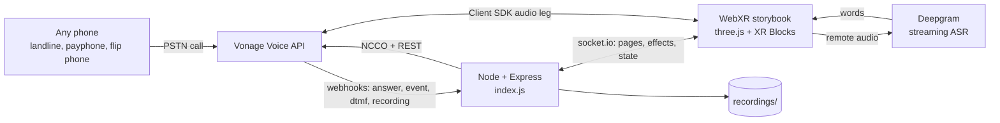
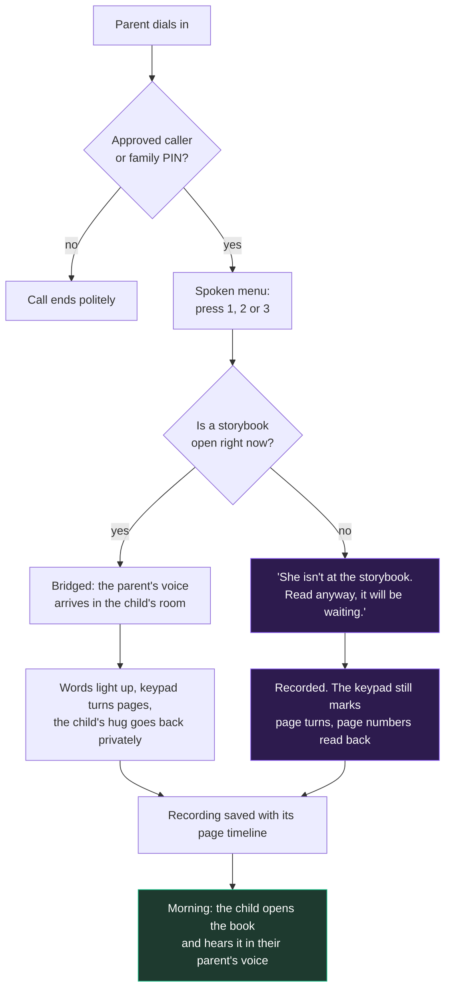

# Once Upon a Call 📖📞

**A bedtime story read over any phone, into a storybook the child can see.**

A parent dials an ordinary phone number. In the child's room a 3D storybook opens and their
parent's voice is in it. The parent turns the pages from their phone keypad. They never see a
screen, and they never need an app.

And if nobody is at the storybook, the call does not fail. The parent is invited to read anyway,
and the story is waiting in the morning, in their voice.

Built for the **DIALED IN Builder Challenge** (CreateHER Fest × Vonage) with the Vonage Voice API.

---

## The problem

About **1 in 14 children in the United States has had a parent in prison**
([Annie E. Casey Foundation, KIDS COUNT](https://www.aecf.org/resources/a-shared-sentence)).
Hundreds of thousands more have a parent deployed, working nights, in hospital, or an ocean away
for work.

Those parents are not offline. They are **screenless**. What reaches home is a phone call, often a
scheduled one, often on a handset with twelve keys and nothing else.

Meanwhile the advice every paediatrician gives is the same: **read to your child, every day, from
infancy** ([American Academy of Pediatrics policy statement, 2014](https://publications.aap.org/pediatrics/article/134/2/404/32946)).
The UK charity [Storybook Dads](https://www.storybookdads.org.uk/) has spent twenty years proving
the point the hard way, recording incarcerated parents reading picture books, burning them to
disc and posting them home.

This asks what that looks like if the phone call itself becomes the storybook.

---

## What it does

| | |
|---|---|
| **Choose the book** | The call opens with a spoken menu. Press **1**, **2** or **3**. The shelf on the child's screen changes before a word is read. |
| **Read together** | The parent's voice drives a lip-synced avatar beside the book and a live transcription, so each word lights up as it is read. |
| **The keypad is the remote** | **#** turns the page, **\*** goes back, **1 2 3** fire surprises in the illustration. |
| **The room answers back** | The child taps a star and the parent hears *"Maya just sent you a big hug"* in their ear alone. |
| **Nobody home?** | The call is not wasted. The parent reads to the empty room, it is recorded, and the child finds it in the morning. |
| **The morning replay** | The recording plays back with the pages turning exactly where the parent pressed **#**. |
| **No phone to hand?** | Press **▶ Watch the story** for a narrated tour that drives the same page, highlight and effect code. |

---

## Architecture



The parent's audio never touches our server. It goes phone → Vonage → the browser's Client SDK
leg. What the server carries is control: which page, which effect, what to say back.

### One call, two endings

The right-hand branch is the part that makes this more than a phone remote.



---

## Vonage features used, and why

| Feature | What it does here |
|---|---|
| NCCO `talk` + `input` | The spoken story menu, the family PIN gate, page numbers read back |
| NCCO `connect` | Bridges the phone to the WebXR app over the Client SDK |
| NCCO `record` | Keeps the story from a live call |
| NCCO `conversation` with `record` | Holds the line open for a parent reading to an empty room, and records **that**, because a `record` action stops at the mouth of a conversation |
| Asynchronous DTMF (`subscribeDTMF`) | Every keypress arrives as a webhook and turns a page in 3D, mid-call |
| Per-leg TTS (`playTTS`) | The child's message is played into the parent's leg only |
| `transferCallWithNCCO` | Moves a caller into the empty-room read when the ring goes unanswered |
| `downloadRecording` | Fetches the mp3 server-side, so no credentials reach the browser |
| Users API (`users.createUser`) | The child's app is a real Vonage user the phone can ring |
| Messages API (`messages.send`) | Optional SMS to a caregiver when a story is waiting |

It degrades all the way down, on purpose:

- **No headset** → the XR Blocks simulator in any browser
- **No Deepgram key** → words stop glowing, everything else works
- **No phone** → **▶ Watch the story** narrates the whole book

---

## Run it

Node 18 or newer.

```bash
npm install
cp .env.example .env     # then fill it in
```

Vonage has to be able to reach your server. Two ways:

### Option A: from your own machine (recommended)

```bash
npm run demo
```

One command: it opens a public [cloudflared](https://developers.cloudflare.com/cloudflare-one/connections/connect-networks/do-more-with-tunnels/trycloudflare/)
tunnel (no account needed), points your Vonage application's webhooks at it, starts the server
behind it, and waits until the tunnel actually answers. `Ctrl+C` closes both.

```
Tunnel open: https://<four-words>.trycloudflare.com
Pointing Vonage application <id> at https://<four-words>.trycloudflare.com
  answer -> https://<four-words>.trycloudflare.com/voice/answer
  event  -> https://<four-words>.trycloudflare.com/voice/event
Once Upon a Call listening on 3000
Public URL reachable (https://<four-words>.trycloudflare.com) - Vonage can call in.
```

Open that URL. That is the storybook.

### Option B: GitHub Codespaces

```bash
npm start
```

The public URL is derived from the Codespace. The port is forwarded **Private** by default, which
answers Vonage with nothing and your browser with a 404, so make it public:

```bash
gh codespace ports visibility 3000:public -c $CODESPACE_NAME
```

The server checks its own public URL at boot and prints this command if it is still closed.

> If the port is already public and it still 404s, the Codespace tunnel itself is broken. Use
> `npm run demo` instead; it does not go through GitHub's relay.

### Moving the webhooks by hand

The answer and event URLs live **on the Vonage application, not on the call**. If the public URL
moves and you skip this, Vonage dials a dead host, the caller hears silence, and nothing reaches
the server to log because the request never arrives.

```bash
npm run webhooks
```

`npm run demo` does this for you. `setup-project.js` creates the application from scratch.

---

## Configuration

Everything lives in `.env`. See [`.env.example`](.env.example).

| Variable | Required | What it is |
|---|---|---|
| `API_APPLICATION_ID` | yes | Vonage application id |
| `PRIVATE_KEY` or `PRIVATE_KEY64` | yes | Path to `private.key`, or the key base64-encoded |
| `VONAGE_PHONE_NUMBER` | yes | The number parents dial |
| `VONAGE_API_KEY` / `VONAGE_API_SECRET` | for setup | Used by `setup-project.js` and `npm run webhooks` |
| `PUBLIC_URL` | if not on Codespaces | Your tunnel URL |
| `CHILD_NAME` / `PARENT_NAME` | no | Overrides the names in the story files |
| `DEEPGRAM_API_KEY` | no | Live word highlighting. Omit and the rest still works |
| `APPROVED_NUMBERS` | no | Comma-separated allow-list. Empty means open demo mode |
| `FAMILY_PIN` | no | Digits an unknown caller must enter |
| `CAREGIVER_NUMBER` | no | Gets an SMS when a story is saved |
| `RECORDING_KEEP_DAYS` | no | Retention window, default 30. `0` disables |
| `RECORDING_KEEP_MAX` | no | Keep the newest N recordings, default 20. `0` disables |

---

## Testing

Two suites run against the real server with no Vonage credentials, using a throwaway RSA key
generated into the OS temp directory.

```bash
npm test
```

- **`test/preview.test.js`** (18 checks) covers the narrated preview's word timing and the story
  shelf's data integrity.
- **`test/flow.test.js`** (35 checks) boots `index.js` for real and drives the whole webhook
  contract **in the order Vonage actually sends it**, which matters: `answered` fires at the start
  of the NCCO, not when the story begins, and a test that posts events in a tidier order passes
  while the app is broken. It covers the menu and its retry, the empty-room read, the keypad
  timeline, recording filing, the morning replay, and the ring-timeout fallthrough.

Four browser suites drive real Chrome with Puppeteer. They need the static fixture server first:

```bash
npm run fixture       # in one terminal, serves the pages on :3210
npm run test:browser  # in another
```

- **`test:layout`** renders 4 viewports × 2 states and checks nothing is unreachable or clipped
- **`test:pages`** loads every page and fails on a console error or a broken asset
- **`test:art`** renders every scene in every story and checks the illustrations actually draw
- **`test:effects`** presses every key on every page and fails on a keypress that does nothing
  visible, which is how six dead keypresses were found

There is also a manual end-to-end plan in [TESTING.md](TESTING.md) with the exact terminal output
and spoken prompts to expect, taken from the code rather than written from memory.

---

## Adding a story

Drop a JSON file in `static/stories/`. It appears on the shelf and in the keypad menu with no code
change.

```json
{
  "id": "rabbit",
  "order": 2,
  "title": "The Rabbit Who Waited for the Moon",
  "menuLabel": "the rabbit who waited for the moon",
  "character": "rabbit",
  "childName": "Maya",
  "parentName": "Dad",
  "pages": [
    { "text": "In a burrow under the old oak tree...", "scene": "burrow", "keywords": ["burrow"] }
  ],
  "effects": {
    "1": { "label": "Rabbit thump", "sound": "roar" },
    "2": { "label": "Twinkle", "sound": "twinkle" },
    "3": { "label": "Moon hum", "sound": "hum" }
  }
}
```

`scene` picks a backdrop from the table in `static/Storybook.js`. `keywords` are the words the
illustration listens for. Art lives in code, so writing a story stays a writing job.

---

## Safety and privacy

- **Who may enter the room.** `APPROVED_NUMBERS` is an allow-list. Anyone else is asked for
  `FAMILY_PIN` before the story opens. Both empty means open demo mode, which is what the demo
  video uses.
- **The caller's number is masked** on the child's screen down to the last four digits.
- **Recordings are downloaded server-side.** Vonage credentials never reach the browser.
- **Retention is explicit.** Recordings are a child and their parent, kept unencrypted on disk.
  The newest `RECORDING_KEEP_MAX` and anything inside `RECORDING_KEEP_DAYS` stay; the rest are
  swept at startup and after each new story. **A story nobody has heard yet is never swept up**,
  however old, because it is the one thing in there somebody is still waiting for.

---

## Project layout

```
index.js              Express + socket.io server, all Vonage integration
tunnel.js             npm run demo: tunnel + webhooks + server
update-webhooks.js    npm run webhooks: repoint the Vonage application
setup-project.js      creates the Vonage application and writes private.key
pages/                index.html (the storybook), caregiver.html, parent-card.html
static/               main.js, VonageAudioCall.js, Storybook.js, StoryListener.js
static/stories/       one JSON file per book
test/                 six suites, described above
```

---

## What's next

Real families rather than a demo family: multiple children, per-family rooms keyed by the dialled
number, and letting a parent record a story for a specific night.

Working with the people who already do this by hand. Storybook Dads and prison family-literacy
programmes burn recordings to disc and mail them. This does the same job over the phone system
that is already in the building.

And the accessibility case: a parent who cannot read the page could have it read to them, and
still turn the pages, still be the voice in the room.

---

## References

- Annie E. Casey Foundation, *A Shared Sentence* (KIDS COUNT policy report) — [aecf.org](https://www.aecf.org/resources/a-shared-sentence)
- American Academy of Pediatrics, *Literacy Promotion: An Essential Component of Primary Care Pediatric Practice* (2014) — [publications.aap.org](https://publications.aap.org/pediatrics/article/134/2/404/32946)
- Storybook Dads — [storybookdads.org.uk](https://www.storybookdads.org.uk/)
- Vonage Voice API, NCCO reference — [developer.vonage.com](https://developer.vonage.com/en/voice/voice-api/ncco-reference)
- XR Blocks — [github.com/google/xrblocks](https://github.com/google/xrblocks)

## License

MIT. See [LICENSE](LICENSE).
